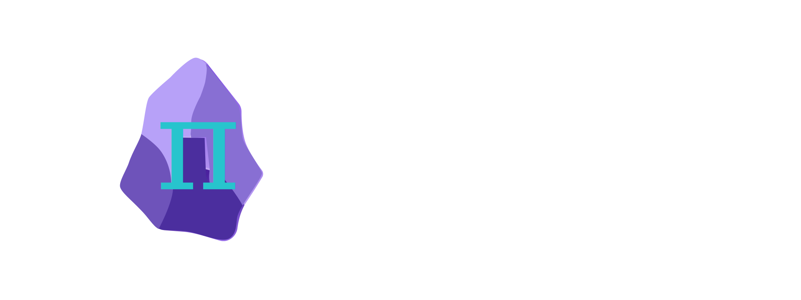
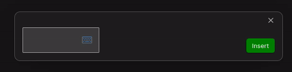

The must-have plugin for math in Obsidian

<a href="https://mathlive.danz.blog" style="font-size:1.5em;">Visit the Website</a>

## Intuitive Math Editor

## Formula OCR

# Background of this project
For the past few years I have been taking math and computer science courses while also working in a full time job as a software engineer.
The material is not a must for most programming jobs. I have decided to continue studying because of my interest and in order to open doors for working on more research oriented tasks.

Most students who persue a degree, do it as a means to get a job. In contrast, I persue a degree solely to understand math and computers on a deeper level. To me, it is very important to keep the knowledge I aquire for future use.

The problem is that it is very common to forget the material. Each course is a very dense and concentrated effort on a very specific topic. But in order to keep the knowledge for a lifetime, it is required to keep interacting with it even after the test. This is why Obsidian's ecosystem and phylosophy seemed promising to me.

So I started using Obsidian as a notebook for my courses. I quickly found out math was possible but not in an efficient way. I realised that a plugin that would focus on math convenience and speed would be valuable to Obsidian's community.

# Usage
1. When creating new math content, an *Edit in MathLive* action is used to start creating the math visually.
1. Editing existing math content is also supported by selecting math content and using the *Edit in MathLive* action.

# Recommended Setup
It is recommended to assign a hot key in order to quickly open up the visual editor.

# MathLive
[MathLive](https://cortexjs.io/mathlive/) is a web component for math content input.

# Future Plans
Obsidian MathLive currently uses a Modal that contains the math editor. ideally, the plugin should be implemented as an [Editor Extension](https://marcus.se.net/obsidian-plugin-docs/editor/extensions).
