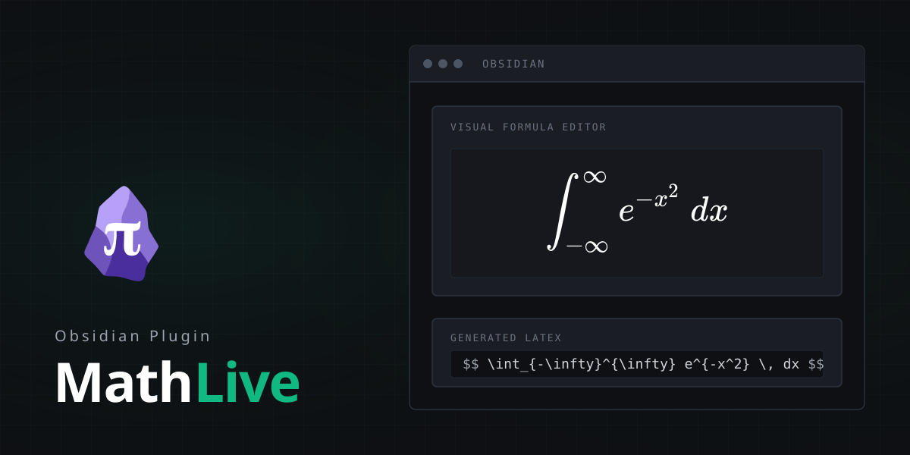

# MathLive Plugin for Obsidian

MathLive is an Obsidian plugin for writing and editing LaTeX math without leaving your notes. It embeds a visual formula editor powered by [MathLive](https://cortexjs.io/mathlive/) and can turn clipboard images into LaTeX using cloud OCR or a self-hosted server.

<a href="https://mathlive.danz.blog" style="font-size:1.5em;">Visit the Site</a>

## Overview

| Capability | Description |
|------------|-------------|
| **Visual editing** | Open a modal with a live math field; insert inline (`$…$`) or display (`$$…$$`) math into the active note. |
| **Formula OCR** | Paste a formula image from the clipboard; the plugin sends it to a remote or local OCR service and appends the returned LaTeX. |

## Architecture (plugin)

The plugin runs entirely inside Obsidian (TypeScript). It does not ship the OCR model: scanning uses HTTP to either the hosted service or your own instance.

- **Editor path**: Commands open a modal with a `<math-field>` web component; on confirm, the selection in the editor is replaced with the chosen delimiters and LaTeX.
- **OCR path**: The plugin reads `image/png` from the system clipboard, builds `multipart/form-data` with a `file` field, and `POST`s to the configured base URL with your API key (cloud only).

## Cloud OCR and API usage

When **Self hosted** is off in settings, requests go to `https://mathlive-ocr.danz.blog`. When it is on, the base URL is `http://localhost:8502` (same path and body as a standard [LaTeX-OCR](https://github.com/lukas-blecher/LaTeX-OCR) HTTP server).

### `POST /predict/`

**Headers**

- `Api-key`: API key from [mathlive.danz.blog](https://mathlive.danz.blog) (required for the cloud endpoint).

**Body** (`multipart/form-data`)

- `file`: PNG (or other image) bytes of the formula to recognize.

**Response**

- JSON body whose string content is appended to the math field (same shape as the upstream OCR server).

> **Note:** The plugin only runs a scan if the **API key** field is non-empty. For a local server that ignores `Api-key`, you can use any placeholder string so the scan action is enabled.

## Features

- **Visual LaTeX editing**: Edit formulas with a WYSIWYG math field; see output as you type.
- **OCR**
  - **Cloud**: Fast inference on managed infrastructure; sign in at [mathlive.danz.blog](https://mathlive.danz.blog) for an API key and optional tokens.
  - **Self-hosted**: Run [LaTeX-OCR](https://github.com/lukas-blecher/LaTeX-OCR) (or compatible) locally; enable **Self hosted** in the plugin and point traffic to `localhost:8502`.

## Installation

1. Open Obsidian.
2. Go to **Settings → Community plugins**.
3. Click **Browse** and search for **MathLive**.
4. Click **Install**, then **Enable**.

## Usage

### Visual LaTeX editing

1. Open a note.
2. Open the command palette (**Ctrl/Cmd + P**) and run a MathLive command (e.g. **Add inline math** or **Add full-line math**). A shortcut (e.g. **Ctrl + M**) is recommended.
3. Edit in the modal; press **Insert** or **Escape** to write back to the note.

### OCR (cloud)

1. Create an API key at [mathlive.danz.blog](https://mathlive.danz.blog).
2. In **Settings → MathLive**, paste the key under **API key**. Leave **Self hosted** disabled.
3. Copy a formula image to the clipboard, open the MathLive modal, and use **Scan MathJax from Clipboard**.

### OCR (self-hosted)

> Self-hosting needs comfort with Docker or Python tooling and uses CPU/GPU on your machine. The cloud option is simpler for most users.

1. Follow [LaTeX-OCR](https://github.com/lukas-blecher/LaTeX-OCR) setup until an HTTP server responds on `http://localhost:8502`.
2. In plugin settings, enable **Self hosted**.
3. Use **Scan MathJax from Clipboard** as above.

## Support

Issues and feature requests: [github.com/danzilberdan/obsidian-mathlive](https://github.com/danzilberdan/obsidian-mathlive).

## Background

For several years I studied math and computer science alongside a full-time engineering role—not for a credential alone, but to understand the material deeply and retain it. Obsidian fit that goal: dense courses are easier to revisit if notes stay alive after exams.

Math in Obsidian was possible but slow. This plugin prioritizes speed and ergonomics for everyday note-taking. More context: [Math in Obsidian](https://danz.blog/math-in-obsidian/).

## Acknowledgements

- [MathLive](https://github.com/arnog/mathlive) for the visual editor.
- [LaTeX-OCR](https://github.com/lukas-blecher/LaTeX-OCR) for the open-source OCR stack and HTTP API shape.
