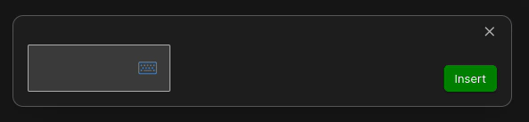

# MathLive Plugin for Obsidian Docs

MathLive is a powerful Obsidian plugin that simplifies the process of creating and editing LaTeX formulas. It provides an intuitive interface for visual editing and an OCR feature to convert scanned images into LaTeX code with a single click.

<a href="https://mathlive.danz.blog" style="font-size:1.5em;">Visit the Site</a>

## Intuitive Math Editor

## Formula OCR

## Features

- **Visual LaTeX Editing**: Type and edit LaTeX formulas visually without needing to write the LaTeX code manually. Formulas are rendered in real-time for easy editing and review.
- **OCR Conversion**: Convert scanned images (e.g., from PDFs or the web) into LaTeX code. This feature is available in two versions:
  - **Cloud-Hosted Version**: Leverage the power of our cloud servers for fast and accurate OCR conversion. With a reasonable one time payment that also supports the development of this plugin.
  - **Open-Source Version**: Run the OCR conversion locally using the open-source implementation.

## Plugin Installation

1. Open Obsidian.
2. Go to Settings > Community plugins.
3. Click on the "Browse" button and search for "MathLive".
4. Click "Install" and then "Enable".

## Usage

### Visual LaTeX Editing

1. Open any note in Obsidian.
2. Open the Command Pallete(ctrl + p) and type "mathlive".
    * It is highly recommended to add a shortcut for fast access during writing. e.g- ctrl + m
3. Choose the "inline" option or the "full-line" option depending on your need.
4. Formulas are rendered in real-time, allowing for seamless editing and review.
5. Save your edit by clicking "Insert" or by clicking Escape.

### OCR Conversion

#### Paid Cloud-Hosted Version

1. Head over to [Obsidian MathLive](https://mathlive.danz.blog)
2. Sign in and follow the instructions.

#### Open-Source Version

> **Note**: The open-source version requires a certain level of technical skill to set up and maintain. Additionally, it may not perform as efficiently as the cloud-hosted version as it will consume system resources. Users who prefer a hassle-free experience and better performance might find the paid cloud-hosted version more suitable.

1. Follow the setup instructions in the [OCR open-source repository](https://github.com/lukas-blecher/LaTeX-OCR).
2. You should end up with an HTTP server running locally on `http://localhost:8502`. Open this page on a browser to make sure the server is running.
3. In the MathLive plugin settings, allow the "Self Hosted" option.
4. At this point you should be able to use the OCR feature in the plugin.

## Support

For any issues or feature requests, please open an issue on our [GitHub repository](https://github.com/danzilberdan/obsidian-mathlive).

# Background of this project
For the past few years I have been taking math and computer science courses while also working in a full time job as a software engineer.
The material is not a must for most programming jobs. I have decided to continue studying because of my interest and in order to open doors for working on more research oriented tasks.

Most students who persue a degree, do it as a means to get a job. In contrast, I persue a degree solely to understand math and computers on a deeper level. To me, it is very important to keep the knowledge I acquire for future use.

The problem is that it is very common to forget the material. Each course is a very dense and concentrated effort on a very specific topic. But in order to keep the knowledge for a lifetime, it is required to keep interacting with it even after the test. This is why Obsidian's ecosystem and philosophy seemed promising to me.

So I started using Obsidian as a notebook for my courses. I quickly found out math was possible but not in an efficient way. I realised that a plugin that would focus on math convenience and speed would be valuable to Obsidian's community.

Here is a [blog post](https://danz.blog/math-in-obsidian/) I wrote about it.

## Acknowledgements

- [MathLive Library](https://github.com/arnog/mathlive) for the visual LaTeX editor.
- [Latex OCR](https://github.com/lukas-blecher/LaTeX-OCR) for the open-source OCR functionality.
